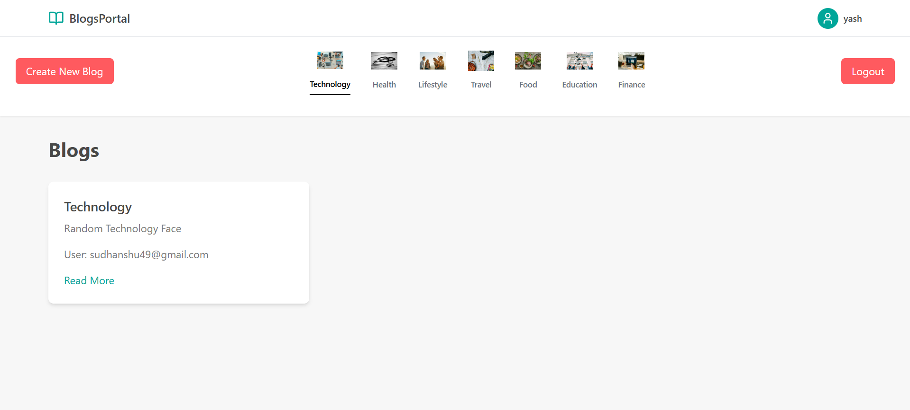

# Blog Application

## Overview

This is a modern, responsive blog application built with React, TypeScript, and Tailwind CSS. It features user authentication, blog post creation and management, and category-based filtering.

## Features

- User authentication (login and registration)
- Protected routes for authenticated users
- Blog post creation with title, description, category, and optional link
- Category-based filtering of blog posts
- Responsive design for mobile and desktop views
- State management using Zustand

## Technologies Used

### Frontend

- React + Vite
- TypeScript
- Tailwind CSS
- Zustand (for state management)
- React Router (for routing)

### Backend

- Node.js
- Express
- MongoDB
- TypeScript
- JWT for authentication

## Screenshots





## Project Structure

### Frontend Structure

```
src/
├── assets/
├── components/
│   ├── BlogsPage.tsx
│   ├── CreateBlogModal.tsx
│   ├── Header.tsx
│   ├── Menu.tsx
│   ├── Login.tsx
│   └── Register.tsx
├── hooks/
├── api.ts
├── App.css
├── App.tsx
├── index.css
├── main.tsx
├── store.tsx
├── types.ts
└── vite-env.d.ts

public/
└── [static files]
```

### Backend Structure

```
src/
├── config/
├── controllers/
├── db/
├── dto/
├── middleware/
├── models/
├── routes/
├── services/
├── utils/
└── index.ts

[configuration files]
├── .env
├── package.json
├── tsconfig.json
└── .gitignore
```

## Environment Variables

### Frontend (.env)

```
VITE_BACKEND_URI=your_backend_url_here
```

### Backend (.env)

```
JWT_SECRET=your_jwt_secret_here
MONGO_URI=your_mongodb_connection_string
CLOUDINARY_CLOUD_NAME=your_cloudinary_cloud_name
CLOUDINARY_API_KEY=your_cloudinary_api_key
CLOUDINARY_API_SECRET=your_cloudinary_api_secret
```

## Installation

1. Clone the repository:

   ```
   git clone https://github.com/MysteryHawk17/sploot
   cd sploot
   ```

2. Install frontend dependencies:

   ```
   cd frontend
   npm install
   ```

3. Install backend dependencies:

   ```
   cd ../backend
   npm install
   ```

4. Set up environment variables:
   - Create `.env` file in frontend directory with required variables
   - Create `.env` file in backend directory with required variables

## Running the Application

### Frontend

```
cd frontend
npm run dev
```

The frontend will be available at `http://localhost:5173`.

### Backend

```
cd backend
npm run dev
```

The backend will be available at `http://localhost:8000`.

## Error Handling

The application includes error handling for common scenarios:

- Registration failures (e.g., user already exists)
- Login failures (incorrect credentials)

Error messages are displayed within the respective components to provide immediate feedback to the user.

## State Management

This application uses Zustand for state management. The main store (`src/store.ts`) handles:

- User authentication state
- Blog posts
- Categories
- Selected category

## Styling

Tailwind CSS is used for styling the application. The color scheme is based on the following palette:

- `#FF5A5F`
- `#00A699`
- `#FC642D`
- `#484848`
- `#767676`

## Contributing

Contributions are welcome! Please feel free to submit a Pull Request.
